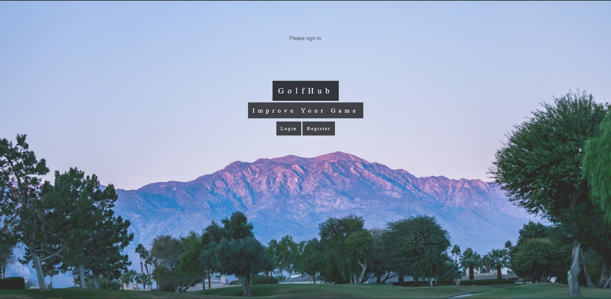
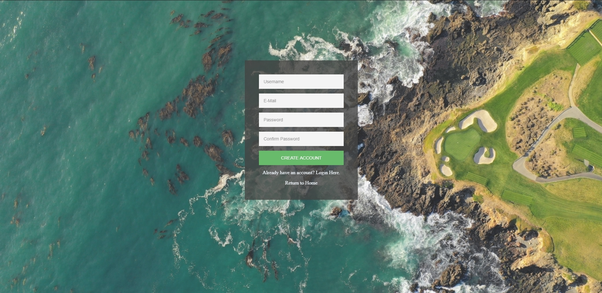
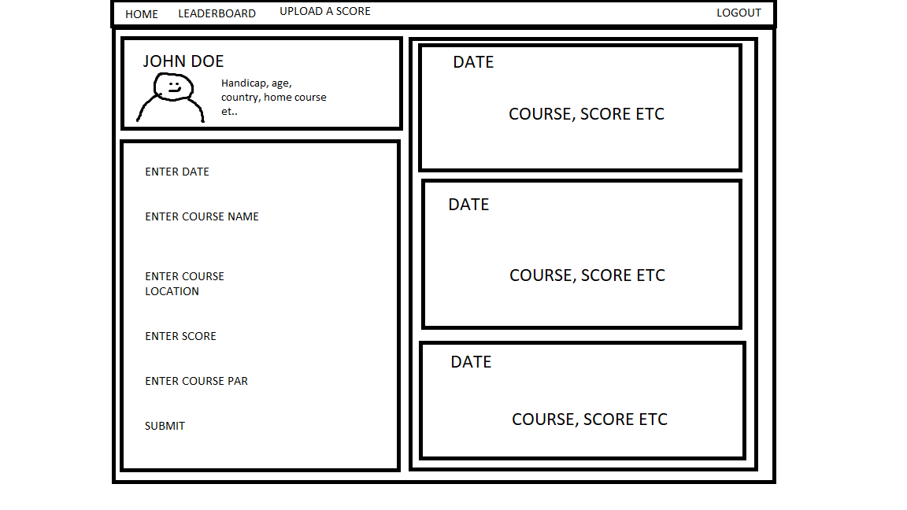
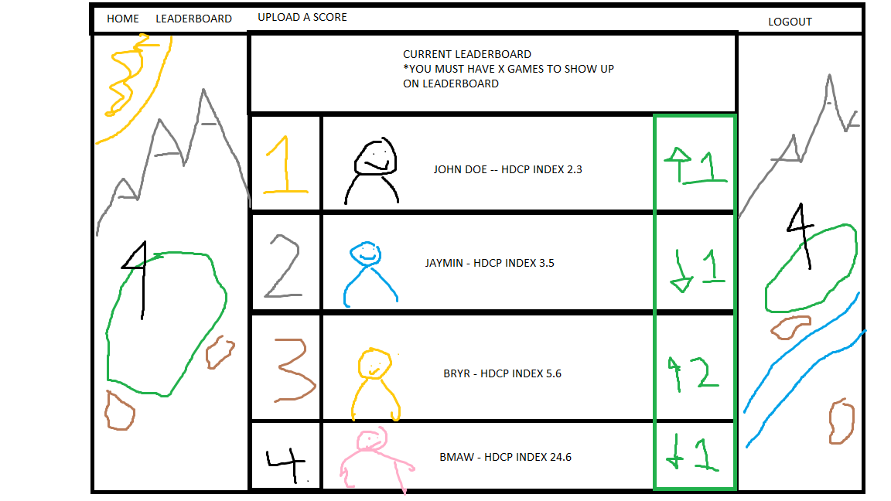

<h1>GolfHub</h1>

<h3> Creating a full stack site to compare golf scores</h3>

My first real project. Should be a website that allows me and my friends to enter our recent golf scores on our profiles and than be able to compare via the leaderboard screen. 

Barebones website live here: http://golfhub.rf.gd/index.php

Please feel free to offer any advice or assistance, I am very new to programming and most of this is learning as I go.

 
 

- [x] Home Page
- [x] Functional Register/Login/Logout
- [ ] Profile Page
- [ ] Leaderboard Page
- [ ] Algorithm for Handicap and Leaderboard
- [ ] Navigation Bar --- HOME | LEADERBOARD | UPLOAD SCORE | ----------- LOGOUT
- [ ] Create or commision a logo for the login and home pages, adopt a font for the website.
- [ ] Forgot your password?
- [ ] Possibly verification on signup / Send email thanking user for signup
- [x] Add more stuff as I think of it

